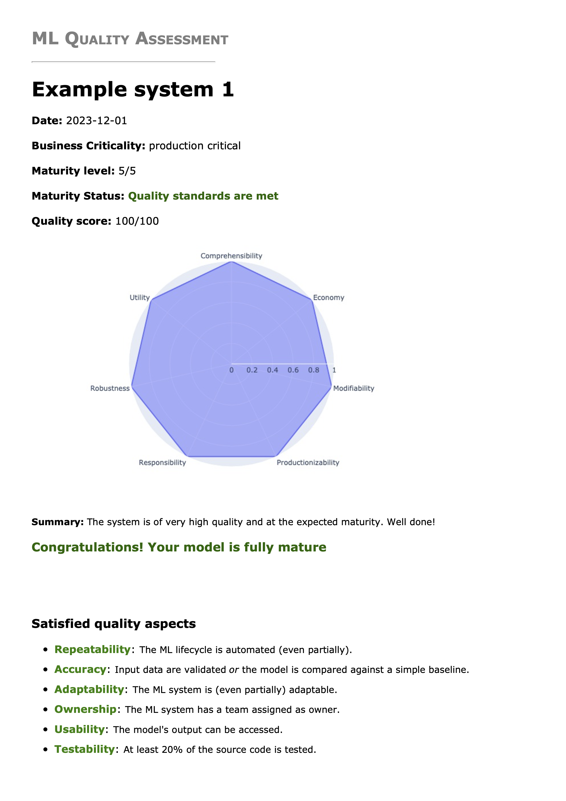
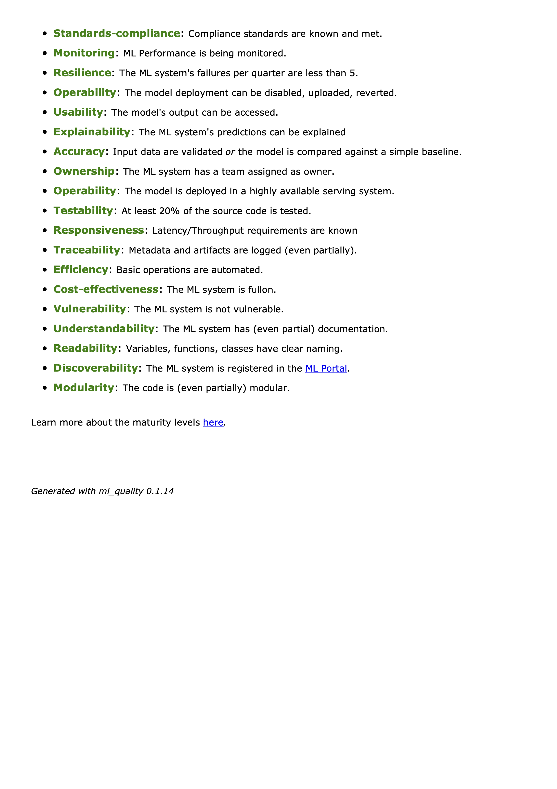
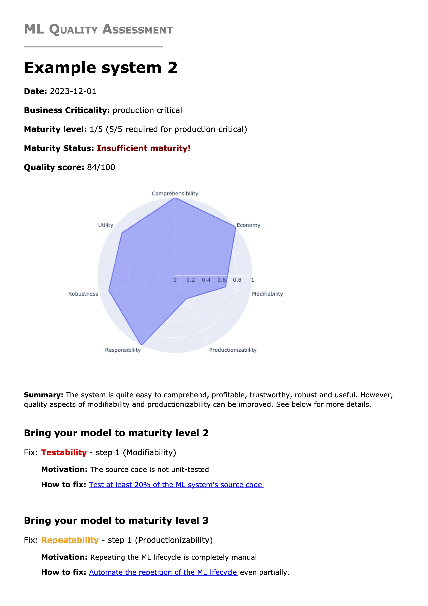
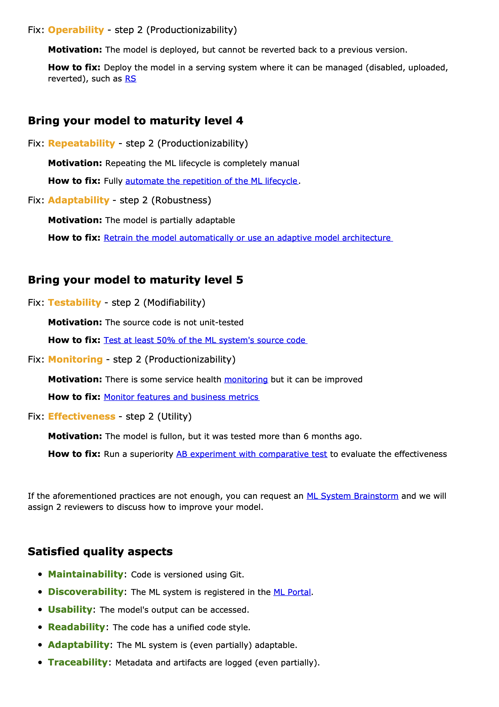

# Machine Learning Quality and Maturity Package

This repository houses the Machine Learning (ML) Quality and Maturity Framework package developed at Booking.com.\
The structure of the repository is delineated as follows:

* The primary class, located in `assessments.py`, serves the function of generating the final quality and maturity score.\
Additionally, it creates a report detailing the technical gaps identified, along with recommended best practices for their mitigation.\
Initialization of this class involves parsing a `.csv` file containing technical gap information for each quality sub-characteristic.

* The file `assessment_automation.py` is dedicated to inferring the gaps present in a model based on data extracted from the ML registry. 
The ML registry serves as a database housing pertinent information regarding the models under analysis.

* The file `report_automation.py`, provides utilities for automating the generation of multiple reports, 
as well as the aggregation of historical evaluation data into a single dataset.

* The `practice_prioritization` directory contains code responsible for prioritizing the sequence of best practices 
to be applied in addressing identified technical gaps.

### Set up the environment and run the tests
To verify the functionality of the repository, create a Python virtual environment, following the instructions below.
The package was tested using `python3.9`.

```
python -m ensurepip --upgrade  # Make sure you have pip installed
pip install virtualenv
python -m venv venv
source ./venv/bin/activate  # Activates the virtual environment
pip install -r requirements.txt 
```
To verify everything is working properly you can run the test suite of the package.\
You can do this by typing `tox` from the package root directory.

#### wkhtmltopdf dependency

In case wkhtmltopdf is missing, install as follows:
 - MacOS: `brew install Caskroom/cask/wkhtmltopdf`
 - Linux: `sudo apt install -y wkhtmltopdf`

### Generate a quality report
To generate a quality and maturity report, follow the example provided in the `create_quality_report.ipynb` notebook.
To run the notebook first create a Jupyter kernel from the virtual environment:

```
pip install ipykernel
python -m ipykernel install --user --name=venv
jupyter notebook
```

#### Automation levels
When generating a quality report, we provide 2 levels of automation with different requirements: 
- **Semi-automated**: This method requires gathering the ML system's quality information through a Google form, using the 
questions specified in [quality_assessment_form.md](quality_assessment_form.md) and manually converting them into
technical gaps using the quality assessment requirements. The gaps should be stored in a `csv` 
file ([example](assessments/inputs/gaps_model_1.csv)). The quality report can then be created following the instructions
in the `create_quality_report.ipynb` notebook.
- **Fully-automated**: This method requires a registry with the ML systems' metadata. Using the function 
`infer_gaps_from_registry_metadata` in [assessment_automation.py](ml_quality/assessment_automation.py) one can 
generate the technical gaps `csv` file with no human intervention, leveraging the information from the registry. The 
quality report is then generated automatically as shown in the `create_quality_report.ipynb` notebook.

### Generate multiple reports from a list of models with technical gaps
To generate multiple reports for a list of models, utilize the script `create_reports.py`. The script generates reports for all models listed in `models_to_assess.csv`.\
It also consolidates previous evaluations into a historical report. You can run the script by typing
```
python create_reports.py
```
The file `models_to_assess.csv` contains the list of models you want to be assessed, the path of the file with technical gaps,\
the date of the evaluation, the team owning the model and the model family (in case the same evaluation is valid for more than a single ML system).
The script will create a `.csv` file with the historical data of all the evaluations stored in the repo. 
The file created will be under `all_models_summary/historical_summary.csv`

# Example reports
Below we provide examples of full quality reports from assessed systems, using the ML quality Python package.  

The images below show an example of a report for a fully mature system. No technical gaps are present, 
all the fulfilled quality attributes are listed in green.




Example of a report for a system of maturity level 1 is provided below. The gaps to be fulfilled to pass to the next 
maturity level are shown in red. The quality attributes to be fulfilled for the subsequent maturity levels are shown in 
orange. Below each quality attribute the user can see both the motivation of a certain technical gap and a 
recommendation to remove it.




## Reconstruct quality improvements from past assessments
Each evaluation produces a report in .html and .pdf format but also a `summary.csv` which stores the 
evaluation input for full reproducibility. These can also be used to re-build historical information
as shown in the notebook `notebooks/monitor_historical_progress.ipynb` and obtain granular information
at sub-characteristic level.
We uploaded in the data a set of anonymized summary reports from Booking.com to give an example of how
to create a plot with quality and maturity improvement per iteration. 
